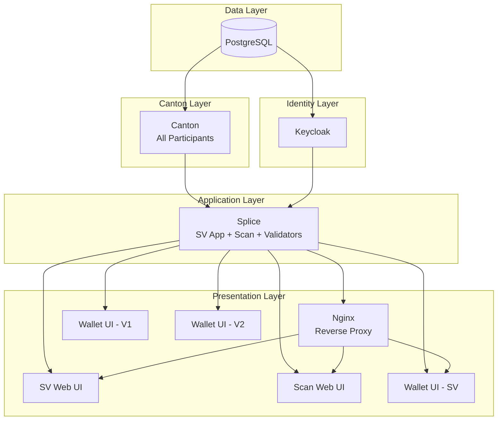
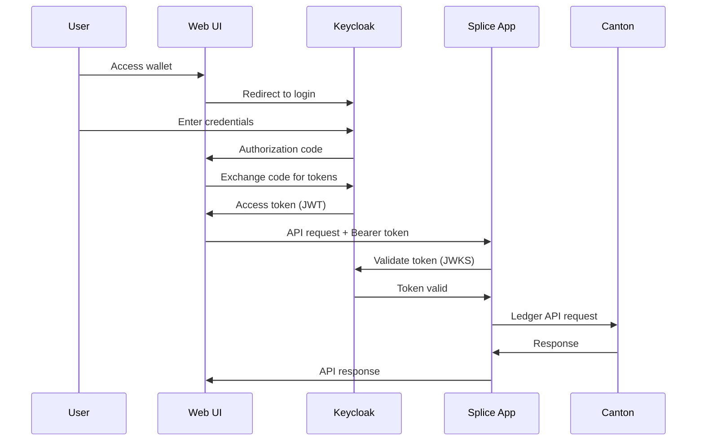
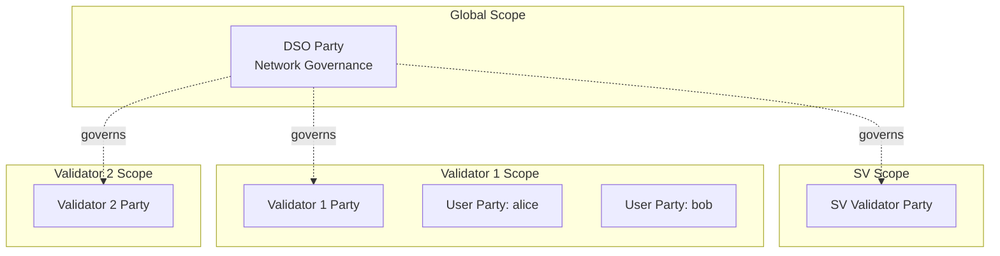
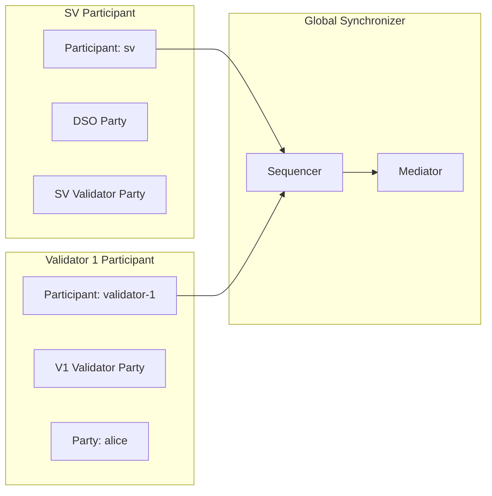
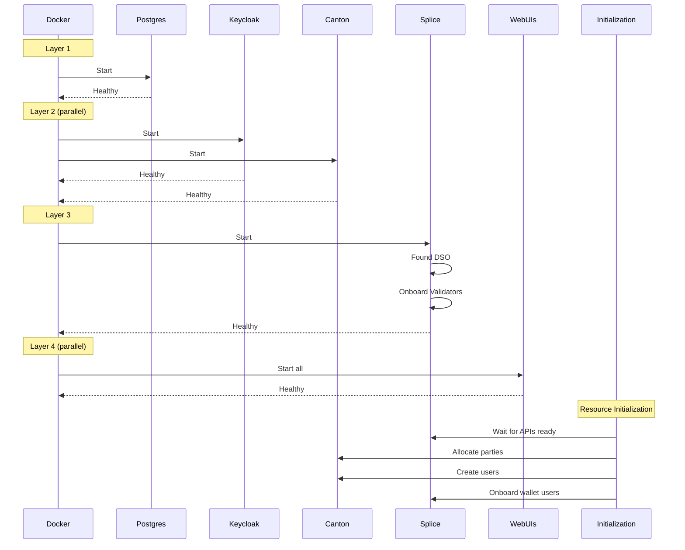
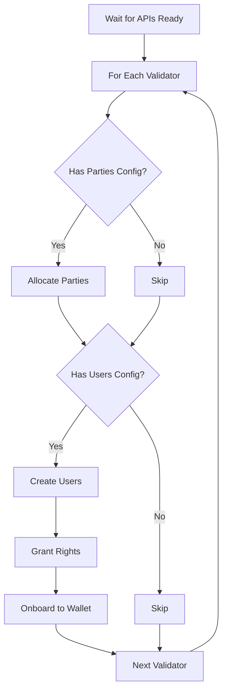
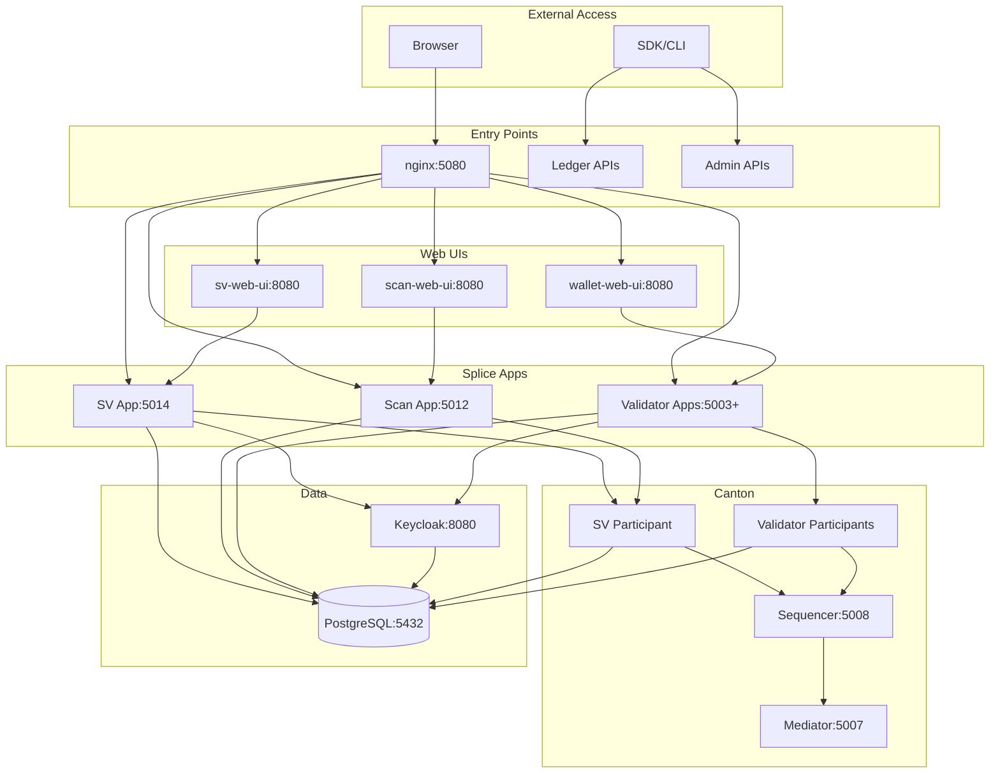

# LocalNet Architecture

> [!NOTE]
> This is a supporting architecture overview. Verify current image tags, exact ports, and runtime
> details against source files and `agents/` guidance before making implementation changes.

This document provides a comprehensive technical overview of the mg-localnet infrastructure,
covering container orchestration, authentication, party management, and initialization flows.

## Table of Contents

1. [Overview](#overview)
2. [Container Architecture](#container-architecture)
3. [Authentication](#authentication)
4. [Parties and Users](#parties-and-users)
5. [Initialization and Onboarding](#initialization-and-onboarding)
6. [Dependency Graph and Connection Points](#dependency-graph-and-connection-points)
7. [Design Decisions](#design-decisions)

---

## Overview

### What is LocalNet?

LocalNet is a development and testing environment for the Canton Network. It provides a complete,
self-contained Canton/Splice infrastructure that runs locally via Docker containers. The primary
goal is to dramatically simplify the setup process for developers working with Canton-based
applications.

### The Simplification

The upstream Canton/Splice infrastructure requires **60-100+ configuration files** to set up a
working network. LocalNet reduces this to a **single YAML file**:

```yaml
version: '1.0'
validators: 2
auth:
  keycloak:
    admin: admin
    password: admin
```

This configuration creates a complete network with:

- 1 Super Validator (implicit, always created)
- 2 Regular Validators (user-specified)
- Full OAuth2 authentication via Keycloak
- All necessary supporting infrastructure

### Quick Reference

#### Default Ports

| Component       | SV (Base: 5000) | Validator 1 (5100) | Validator 2 (5200) |
| --------------- | --------------- | ------------------ | ------------------ |
| HTTP Health     | 5000            | 5100               | 5200               |
| Ledger API      | 5001            | 5101               | 5201               |
| Admin API       | 5002            | 5102               | 5202               |
| Validator Admin | 5003            | 5103               | 5203               |
| gRPC Health     | 5061            | 5161               | 5261               |
| JSON API        | 5075            | 5175               | 5275               |
| Web UI          | 5080            | 5180               | 5280               |
| Keycloak        | 5082            | —                  | —                  |

#### SV-Specific Internal Ports

| Service          | Port |
| ---------------- | ---- |
| Sequencer Public | 5008 |
| Sequencer Admin  | 5009 |
| Mediator Admin   | 5007 |
| Scan Admin       | 5012 |
| SV Admin         | 5014 |

#### Default URLs

| Service            | URL                          |
| ------------------ | ---------------------------- |
| SV Management UI   | http://sv.localhost:5080     |
| Scan Explorer      | http://scan.localhost:5080   |
| SV Wallet          | http://wallet.localhost:5080 |
| Validator 1 Wallet | http://wallet.localhost:5180 |
| Validator 2 Wallet | http://wallet.localhost:5280 |
| Keycloak           | http://localhost:5082        |

---

## Container Architecture

LocalNet orchestrates multiple Docker containers that work together to provide the complete Canton
Network infrastructure.

### Container Overview



### Container Details

#### postgres

**Purpose**: Shared database for all components.

- **Image**: `postgres:14`
- **Role**: Stores all persistent state for Canton participants, Splice apps, and Keycloak
- **Databases Created**:
  - `participant-sv`, `validator-sv`, `sequencer`, `mediator`, `scan`, `sv` (for SV)
  - `participant-{validator-name}`, `validator-{validator-name}` (for each validator)
- **Port**: 5432 (internal)
- **Health Check**: `pg_isready` command

The PostgreSQL container uses a custom entrypoint script that dynamically creates all required
databases on startup based on environment variables.

#### canton

**Purpose**: Runs all Canton participant nodes in a single container.

- **Image**: `ghcr.io/digital-asset/decentralized-canton-sync/docker/canton:0.6.6`
- **Role**: Hosts the ledger participants for SV and all validators
- **Components**:
  - SV Participant (with Sequencer and Mediator for Global Synchronizer)
  - Validator Participants (one per configured validator)
- **Exposed Ports**: Ledger API, Admin API, JSON API for each participant
- **Health Check**: HTTP health endpoint on port 5000
- **Dependencies**: postgres

All participants run in a single Canton process, sharing the same JVM. This matches the upstream
[Splice LocalNet](https://github.com/hyperledger-labs/splice/tree/main/cluster/compose/localnet)
approach and is intentional for development: it saves ~2-4GB RAM, speeds up startup, and Canton
explicitly supports multi-node operation in a single process. Production deployments would use
separate containers or hosts for each participant.

#### splice

**Purpose**: Runs all Splice validator applications.

- **Image**: `ghcr.io/digital-asset/decentralized-canton-sync/docker/splice-app:0.6.6`
- **Role**: Hosts the validator apps that implement Canton Network business logic
- **Components**:
  - SV App (governance, DSO management)
  - Scan App (network explorer backend)
  - SV Validator App
  - Regular Validator Apps (one per configured validator)
- **Exposed Ports**: Validator Admin API for each validator, Scan Admin, SV Admin
- **Health Check**: HTTP request to Scan status endpoint
- **Dependencies**: canton

#### keycloak

**Purpose**: OAuth2 identity provider.

- **Image**: `quay.io/keycloak/keycloak:26.1.0`
- **Role**: Manages user authentication and issues JWT tokens
- **Configuration**: Realms imported on startup from generated JSON files
- **Port**: 5082 (mapped from internal 8080)
- **Health Check**: TCP connection to health endpoint
- **Dependencies**: postgres

Keycloak is always started as part of the LocalNet.

#### nginx

**Purpose**: Reverse proxy for web UIs.

- **Image**: `nginx:1.27.0`
- **Role**: Routes requests to appropriate backend services based on hostname
- **Routing**:
  - `sv.localhost:5080` → SV Web UI + SV Admin API
  - `scan.localhost:5080` → Scan Web UI + Scan API
  - `wallet.localhost:5080` → SV Wallet UI + Validator Admin API
  - `wallet.localhost:5180` → Validator 1 Wallet UI
  - `wallet.localhost:5280` → Validator 2 Wallet UI
- **Health Check**: HTTP request to port 5080
- **Dependencies**: splice

#### Web UI Containers

Each web UI runs in its own container:

| Container                   | Image                 | Purpose                     |
| --------------------------- | --------------------- | --------------------------- |
| `wallet-web-ui-sv`          | `wallet-web-ui:0.6.6` | SV wallet interface         |
| `wallet-web-ui-{validator}` | `wallet-web-ui:0.6.6` | Validator wallet interfaces |
| `sv-web-ui`                 | `sv-web-ui:0.6.6`     | Super Validator management  |
| `scan-web-ui`               | `scan-web-ui:0.6.6`   | Network explorer            |

All web UIs:

- Run on internal port 8080
- Are proxied through nginx
- Receive auth configuration via environment variables
- Depend on splice being healthy

---

## Authentication

LocalNet uses OAuth2 with Keycloak as the only authentication mode.

### OAuth2 Authentication

Keycloak serves as the identity provider for all Splice and Validator Admin APIs.

**Characteristics**:

- RS-256 signature algorithm with JWKS URL for token validation
- Separate Keycloak realm per validator for isolation
- Service accounts for service-to-service authentication
- Public clients for web UI authentication
- Full OIDC flows (authorization code, client credentials)

**Realm Structure**:

- `SV` realm: For Super Validator services and UIs
- `Validator1`, `Validator2`, etc.: One realm per regular validator

**Client Types per Realm**:

| Client ID          | Type         | Purpose                           |
| ------------------ | ------------ | --------------------------------- |
| `{name}-validator` | Confidential | Service account for validator app |
| `{name}-wallet`    | Public       | Wallet web UI authentication      |
| `{name}-backend`   | Confidential | Backend service integration       |
| `{name}-pqs`       | Confidential | PQS (Participant Query Store)     |
| `{name}-unsafe`    | Public       | Direct access grants for testing  |

### Token Flow



### Default Credentials

Default users are created with **username = password**:

| Realm      | Username      | Password      | Purpose                  |
| ---------- | ------------- | ------------- | ------------------------ |
| SV         | `sv`          | `sv`          | SV management, SV Wallet |
| Validator1 | `validator-1` | `validator-1` | Validator 1 wallet       |
| Validator2 | `validator-2` | `validator-2` | Validator 2 wallet       |

The Scan UI is public and does not use login credentials.

For custom validator configurations:

```yaml
validators:
  - name: alice-validator # User: alice-validator / alice-validator
    users:
      - id: alice # User: alice / alice
```

### Token Validation

- Splice apps fetch JWKS from Keycloak:
  `http://keycloak:8080/realms/{realm}/protocol/openid-connect/certs`
- RS-256 signature verification using public keys from JWKS
- Audience claim must match `https://canton.network.global`

---

## Parties and Users

Understanding the relationship between parties, users, and participants is essential for working
with Canton.

### Core Concepts

#### Parties

A **party** is an identity on the Canton ledger. Parties:

- Are the actors in Daml contracts (signatories, observers, controllers)
- Have globally unique identifiers (e.g., `alice::12345abcdef...`)
- Are hosted on one or more participants
- Can submit commands and observe transactions

#### Users

A **user** is an authentication identity that maps to parties. Users:

- Authenticate via JWT tokens
- Have rights granted on specific parties
- Are managed per-participant

#### Participants

A **participant** is a Canton node that:

- Hosts parties
- Processes ledger commands
- Maintains a local copy of relevant ledger state
- Connects to synchronizers (sequencers/mediators)

### Party Types in LocalNet



#### DSO Party

- Created during network bootstrap ("found-dso" operation)
- Represents the Decentralized Synchronizer Operator
- Used for network governance contracts
- Global scope - visible to all participants

#### Validator Parties

- One per validator (including SV)
- Auto-created during validator onboarding
- Used for validator-specific operations
- Party hint derived from validator name or config

#### User Parties

- Additional parties for application use
- Allocated via Ledger API
- Configured in `validators[].parties[]`

### User Rights

Users are granted rights on parties:

| Right              | Description                                                       |
| ------------------ | ----------------------------------------------------------------- |
| `CanActAs`         | Submit commands as the party (create contracts, exercise choices) |
| `CanReadAs`        | Read transactions visible to the party                            |
| `ParticipantAdmin` | Administrative operations on the participant                      |

Example configuration:

```yaml
validators:
  - name: validator-1
    parties:
      - hint: alice
    users:
      - id: alice-user
        primaryParty: alice
        rights: [CanActAs, CanReadAs]
```

### Party-Participant Relationship



Parties are **hosted** on participants but can interact with parties on other participants through
the synchronizer.

---

## Initialization and Onboarding

LocalNet follows a two-phase startup: container startup followed by resource initialization.

### Startup Sequence



### Container Startup Order

Containers start in layers based on dependencies:

| Layer | Containers         | Dependencies |
| ----- | ------------------ | ------------ |
| 1     | postgres           | None         |
| 2     | canton, keycloak   | postgres     |
| 3     | splice             | canton       |
| 4     | nginx, all web UIs | splice       |

Within each layer, containers start in parallel. The next layer only begins after all containers in
the current layer are healthy.

### DSO Creation

The DSO (Decentralized Synchronizer Operator) is created during the first startup:

1. SV App starts with `onboarding.type = found-dso`
2. Creates the DSO party and governance contracts
3. Initializes the Global Synchronizer (Sequencer + Mediator)
4. Subsequent startups skip this (DSO already exists)

### Validator Onboarding

Regular validators onboard to the network via secrets:

1. Each validator has a pre-configured onboarding secret
2. SV App has a list of expected onboarding secrets
3. Validator App connects to SV Admin API with its secret
4. SV validates the secret and onboards the validator
5. Validator receives its party ID and synchronizer connection info

**Onboarding secrets** (generated deterministically):

- `validator-1-onboarding-secret`
- `validator-2-onboarding-secret`
- etc.

### Resource Initialization

After containers are healthy, LocalNet initializes resources:



**Steps**:

1. **Wait for APIs**: Poll each validator's JSON API until responsive
2. **Allocate Parties**: Create parties from `validators[].parties[]` config
3. **Create Users**: Create users from `validators[].users[]` config
4. **Grant Rights**: Assign CanActAs/CanReadAs rights to users
5. **Onboard to Wallet**: Register users with the wallet app

---

## Dependency Graph and Connection Points

### Service Dependencies



### Port Allocation Strategy

Ports are allocated using a deterministic scheme:

```
Base Port (default: 5000)
├── SV: base + 0-99
│   ├── HTTP Health: base + 0  (5000)
│   ├── Ledger API:  base + 1  (5001)
│   ├── Admin API:   base + 2  (5002)
│   ├── Validator Admin: base + 3 (5003)
│   ├── gRPC Health: base + 61 (5061)
│   ├── JSON API:    base + 75 (5075)
│   └── Web UI:      base + 80 (5080)
│
├── Keycloak: base + 82 (5082)
│
├── Validator 1: base + 100-199
│   ├── HTTP Health: base + 100 (5100)
│   ├── Ledger API:  base + 101 (5101)
│   ├── Web UI:      base + 180 (5180)
│   └── ... (same offsets)
│
├── Validator 2: base + 200-299
│   ├── Web UI:      base + 280 (5280)
│   └── ...
│
└── Validator N: base + (N+1)*100 + 80 (Web UI)
```

**Formula**: `port = basePort + (validatorIndex + 1) * 100 + portSuffix`

Where `validatorIndex` is 0-based for regular validators (SV uses index -1 effectively).

### Internal vs External Networking

**Internal (Docker Network)**:

- Containers communicate via hostnames: `canton`, `splice`, `postgres`, `keycloak`
- No port mapping needed for internal communication
- Example: Splice connects to Canton at `canton:5001`

**External (Host Access)**:

- Ports mapped to localhost
- Web UIs accessed via `*.localhost` hostnames
- APIs accessed via `localhost:{port}`

### Connection Points Summary

| Service            | Internal Address | External Address |
| ------------------ | ---------------- | ---------------- |
| PostgreSQL         | `postgres:5432`  | `localhost:5432` |
| Keycloak           | `keycloak:8080`  | `localhost:5082` |
| SV Ledger API      | `canton:5001`    | `localhost:5001` |
| SV Admin API       | `canton:5002`    | `localhost:5002` |
| SV Validator Admin | `splice:5003`    | `localhost:5003` |
| Scan Admin         | `splice:5012`    | `localhost:5012` |
| SV Admin           | `splice:5014`    | `localhost:5014` |
| SV Web UIs (nginx) | `nginx:8080`     | `localhost:5080` |
| V1 Ledger API      | `canton:5101`    | `localhost:5101` |
| V1 Validator Admin | `splice:5103`    | `localhost:5103` |
| V1 Web UI (nginx)  | `nginx:8081`     | `localhost:5180` |

---

## Design Decisions

This section documents key architectural decisions and their rationale.

### 1. SV is Implicit

**Decision**: The Super Validator is always created automatically and cannot be configured by users.

**Rationale**:

- Every Canton Network requires exactly one SV to run the Global Synchronizer
- Exposing SV configuration adds complexity without benefit for local development
- Users only need to think about their application validators
- Simplifies the mental model: "validators" = your validators, SV = infrastructure

**Trade-off**: Less flexibility for advanced scenarios, but these are rare in local development.

### 2. Single Canton/Splice Container

**Decision**: All Canton participants run in one container; all Splice apps run in one container.

**Rationale**:

- Matches the upstream
  [Splice LocalNet](https://github.com/hyperledger-labs/splice/tree/main/cluster/compose/localnet)
  architecture
- Reduces container count and resource usage (~2-4GB RAM saved)
- Simplifies orchestration (fewer containers to manage)
- Faster startup (single JVM warmup)
- Canton explicitly supports multi-node operation in a single process

**Trade-off**: Cannot independently restart individual participants. Acceptable for development.

**Production note**: Production deployments should use separate containers (or hosts) per
participant for failure isolation and independent scaling.

### 3. Shared PostgreSQL

**Decision**: One PostgreSQL container with multiple databases instead of separate containers.

**Rationale**:

- Significantly reduces memory footprint
- Faster startup (one database server)
- Simpler backup/restore for development
- Databases are logically isolated

**Trade-off**: Single point of failure, but acceptable for local development.

### 4. Port Prefix Scheme

**Decision**: Deterministic port allocation using base + offset pattern.

**Rationale**:

- Enables multiple LocalNet instances on same host (different base ports)
- Predictable ports for scripting and automation
- Easy to remember: SV at 5000s, V1 at 5100s, V2 at 5200s
- Consistent offsets across all validators

**Trade-off**: Fixed port ranges may conflict with other services. Mitigated by configurable base
port.

### 5. Realm-per-Validator

**Decision**: Each validator gets its own Keycloak realm.

**Rationale**:

- Isolation between validators (separate user namespaces)
- Realistic simulation of multi-tenant scenarios
- Each validator can have different users/clients
- Matches production deployment patterns

**Trade-off**: More complex Keycloak setup, but generated automatically.

### 6. Automatic Onboarding

**Decision**: Validators onboard automatically via pre-shared secrets.

**Rationale**:

- Zero manual steps for users
- Deterministic secrets enable reproducible setups
- Matches the Splice onboarding flow
- Users don't need to understand onboarding internals

**Trade-off**: Less realistic than manual onboarding, but appropriate for development.

### 7. Development/Testing Focus

**Important**: LocalNet is optimized for development and testing, NOT production.

**Implications**:

- Default credentials are insecure (username = password)
- No TLS/HTTPS configuration
- Shared secrets are predictable
- No high availability or redundancy
- Resource limits not tuned for production loads

For production deployments, refer to the official Canton Network documentation.

---

## Appendix: Container Images

| Component     | Default Image                                                                |
| ------------- | ---------------------------------------------------------------------------- |
| PostgreSQL    | `postgres:14`                                                                |
| Nginx         | `nginx:1.27.0`                                                               |
| Canton        | `ghcr.io/digital-asset/decentralized-canton-sync/docker/canton:0.6.6`        |
| Splice        | `ghcr.io/digital-asset/decentralized-canton-sync/docker/splice-app:0.6.6`    |
| Wallet Web UI | `ghcr.io/digital-asset/decentralized-canton-sync/docker/wallet-web-ui:0.6.6` |
| SV Web UI     | `ghcr.io/digital-asset/decentralized-canton-sync/docker/sv-web-ui:0.6.6`     |
| Scan Web UI   | `ghcr.io/digital-asset/decentralized-canton-sync/docker/scan-web-ui:0.6.6`   |
| Keycloak      | `quay.io/keycloak/keycloak:26.1.0`                                           |
